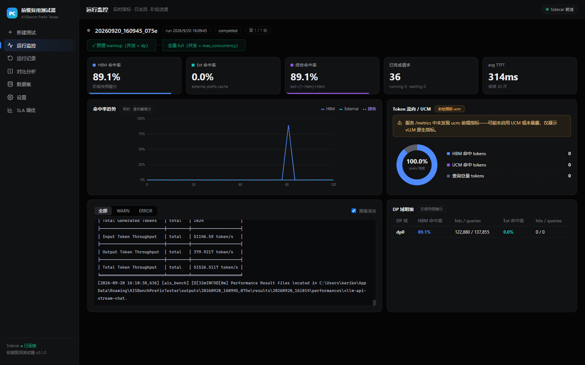
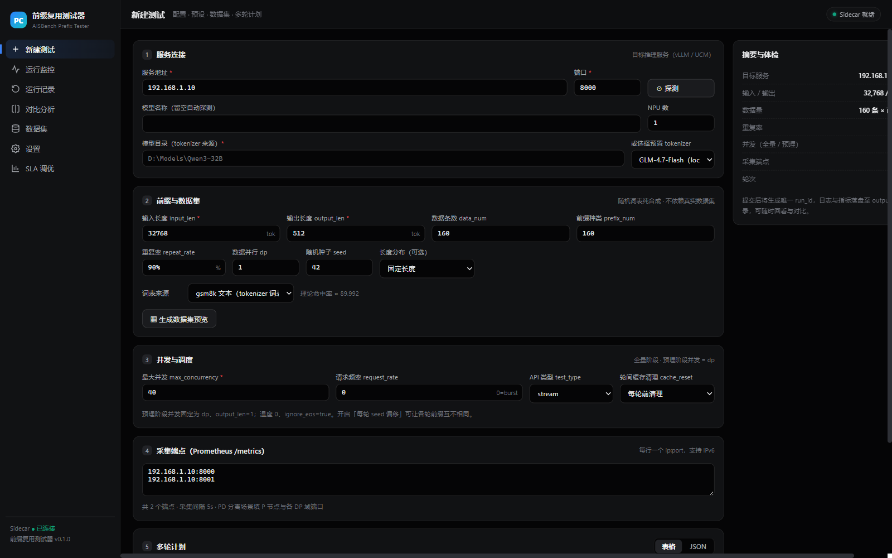
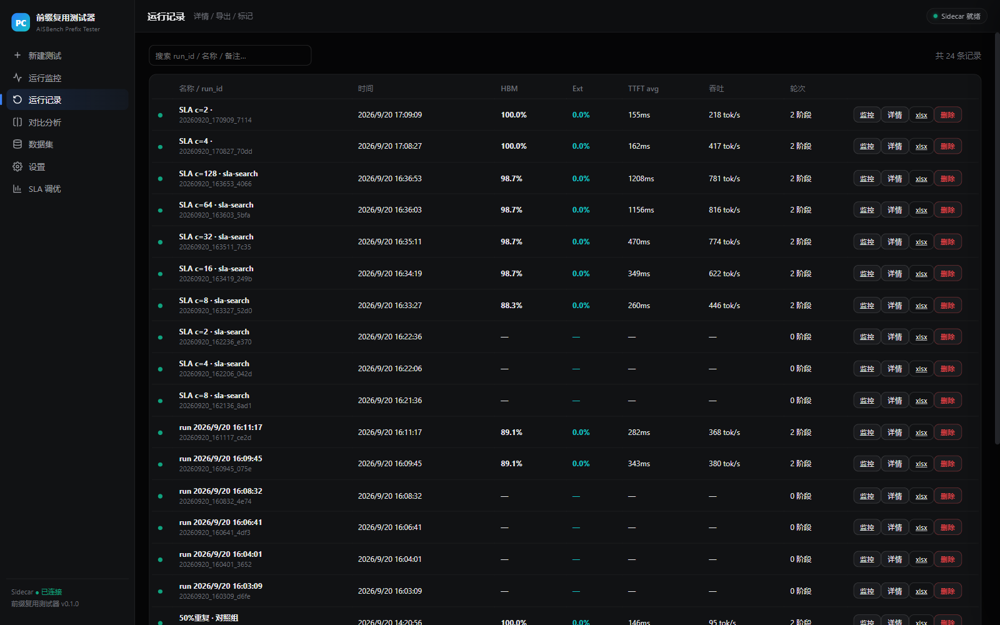
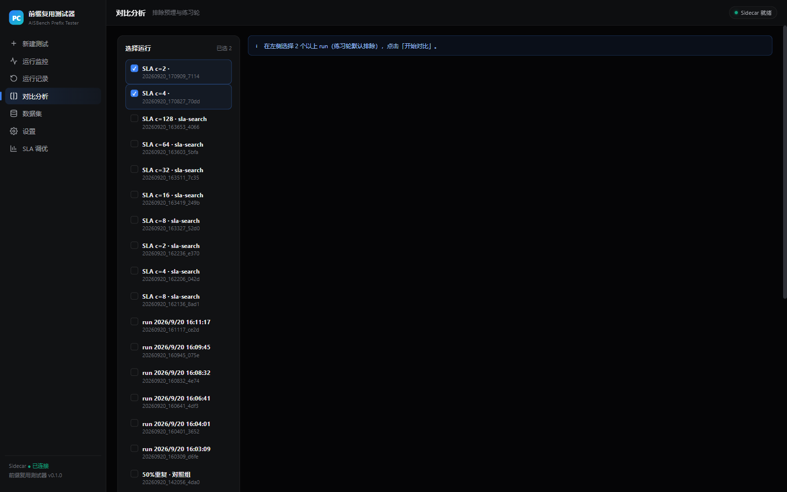
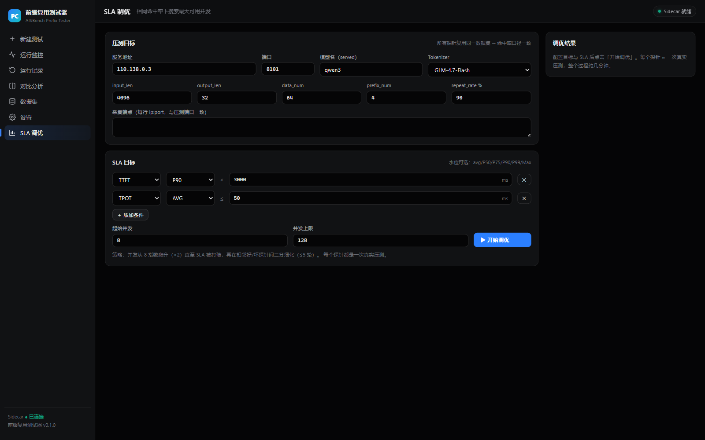
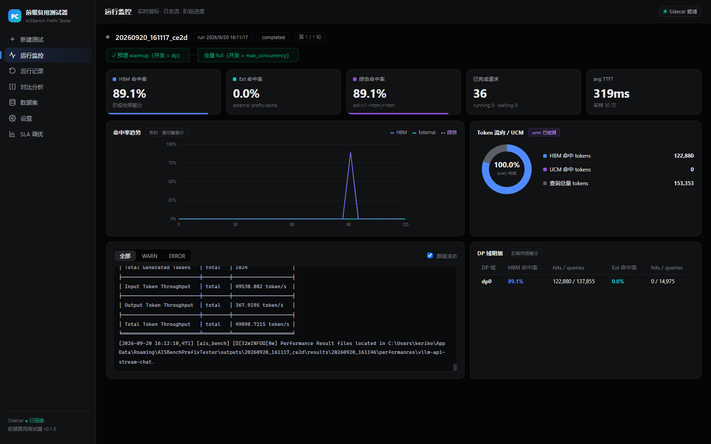

# AISBench 前缀复用测试器

面向大模型推理服务的 **Prefix Cache 性能测试桌面工具**：随机词表数据集纯合成、AISBench 两阶段压测编排、
UCM/vLLM 命中率实时采集、多轮对比报告、SLA 最大并发自动搜索。
**打包版完全自包含**——Python、ais_bench、全部依赖与 tokenizer 资产随包内置，目标机器无需任何环境。

<p align="center">
  
</p>

## 特性

- **自包含运行时**：便携 exe 内置 Python + ais_bench + 全部依赖，零配置开箱即用；`/api/diagnosis` 只做"运行环境是否 ready"的就绪检测
- **随机词表数据集**：不依赖任何真实数据集，tokenizer 词表纯合成，GSM8K JSONL 容器格式；支持 tokenid 精确模式、自定义词表、进度中断续传；数据集可入库复用（同数据集跨 run/跨服务对比口径一致）
- **两阶段压测**：预埋（并发=dp、output_len=1、前缀注入）→ 全量（目标并发），快照差分命中率（Δhits/Δqueries）；支持多轮（轮次编辑器，10 个键按轮覆盖）
- **UCM/vLLM 指标**：5s 轮询 + 阶段快照双通道；`ucm:` 前缀自动探测，per-pod / per-DP 命中率分维度
- **轮间缓存治理**：每轮前 `POST /reset_prefix_cache`（策略可配）；服务不支持时自动回退"每轮 seed 偏移"并在结果行标注残留风险
- **SLA 自动调优**：并发 ×2 阶梯 + 二分细化；**预检快失败**（并发=1 即不满足时拒绝运行并附实测证据）、矛盾/非法阈值拒绝、探针日志实时跟随、历史记录与状态恢复
- **对比与报告**：多 run 对比（自动排除预埋/练习轮，方向感知增量，导出与页面口径一致）→ xlsx（5 Sheet）与离线 HTML 报告
- **运行管理**：类型筛选（手动/SLA 探针）、单条与批量删除、勾选直通对比、跨重启持久化
- **部署形态**：Windows 安装版（秒开）/ 便携 exe（单文件免安装）/ 服务器 Docker 容器（UI + API 同容器），三种形态数据目录互通、均自包含

## 截图

| 新建测试 | 运行记录 |
| --- | --- |
|  |  |
| **对比分析** | **SLA 调优** |
|  |  |
| **运行监控（真实压测）** | **UCM 运行监控** |
|  |  |

更多：[设置诊断](docs/screenshots/s06-settings-dark.png) · [数据集](docs/screenshots/s05-datasets-dark.png) · [Qwen3 实测对比](docs/screenshots/s08-compare-qwen3-real.png) · [SLA 结果](docs/screenshots/s09-sla-result.png)

## 架构

Electron（主进程：sidecar 生命周期守护）+ React 渲染层 + Python FastAPI Sidecar。
Sidecar 仅绑定 `127.0.0.1`，Bearer token + 端口文件发现；目标服务探测/压测/采集全部由 Sidecar 出站完成，不对外暴露。

打包模式（frozen）下 sidecar **自引用执行内置 ais_bench**（`exe --child-aisbench`，config-dir 注入），
不依赖外部 Python/pip/site-packages；tokenizer 资产从 `assets/model/` 随包分发并自动注册。

## 快速开始

### Windows 安装版 / 便携 exe（自包含，推荐）

构建（约 15 分钟，同时产出安装版与便携版到 `D:\pt-release`）：

```bash
pip install pyinstaller
cd sidecar && py -3.11 -m PyInstaller aisbench-sidecar.spec        # 自包含 sidecar（内嵌 ais_bench/tokenizer 资产）
cd ../desktop && npm install && npm run build
npx electron-builder --win --publish never                          # 注意先关掉旧实例，避免输出文件被锁
```

- **安装版** `AISBenchPrefixTester-Setup-<版本>.exe`：标准 Windows 安装向导（中文界面，**可选择安装目录**、桌面/开始菜单快捷方式、完成后运行、控制面板可卸载且保留数据），安装后**秒开**——日常使用推荐
- **便携版** `AISBenchPrefixTester-Portable.exe`：单文件免安装，适合分发/U 盘场景；每次启动需解压（约 30 秒）
- 两者数据目录通用（`%USERPROFILE%\AISBenchPrefixTester`），历史记录无缝衔接；均自包含（Python + ais_bench + 全部依赖内置），目标机器无需任何环境

### 服务器容器（UI + API 同容器）

```bash
docker build -t aisbench-prefix-tester .
docker run -d --name pt-server -p 8180:8180 -v /home/$USER/pt-data:/data aisbench-prefix-tester
# 浏览器打开 http://<服务器IP>:8180
```

### 开发模式（需要外部 Python）

```bash
py -3.11 -m pip install -r sidecar/requirements.txt
py -3.11 tools/tests/test_units.py && py -3.11 tools/tests/test_features.py && py -3.11 tools/tests/test_api.py
cd desktop && npm run dev      # http://localhost:5173（vite 自动拉起 sidecar）
```

开发模式做真实压测需宿主机 `pip install ais_bench_benchmark==3.1.20260630`（Python 3.10–3.12）；
无 GPU 环境用 `tools/mock_aisbench.py` + `tools/mock_vllm/server.py`（本机 8091）全链路联调。
打包模式则完全不需要这些（内置）。

## Tokenizer 资产

把 HuggingFace 格式 tokenizer 目录放进 `assets/model/<名字>/`（仓库打包暂存区，不进 git），
应用自动注册；或运行时在「设置 → Tokenizer 资产」注册任意本机目录。
`assets/model` 已随附 Qwen3.5-0.8B 与 Qwen3-0.6B 四件套（SHA256 与 ModelScope 官方仓逐字节核对）。

从 ModelScope 下载新 tokenizer（直链 / CLI / SDK 三种方式、最小文件集、家族等价性结论）：
**[docs/MODELSCOPE_TOKENIZER.md](docs/MODELSCOPE_TOKENIZER.md)**

## CLI / Agent 接口

```bash
PT="py -3.11 tools/pt.py --port-file desktop/.sidecar-dev.json"   # dev；便携版端口文件在 %USERPROFILE%\AISBenchPrefixTester\

$PT health                     # 版本 / runtime(frozen|source)
$PT diagnosis                  # 运行环境就绪检测（模式、内置 AISBench、tokenizer 资产、磁盘）
$PT probe 203.0.113.10 8201     # 目标服务探测（/v1/models、/metrics、UCM 判定）

# 多轮压测（同数据集；rounds 数组在 UI 编辑，CLI 单轮走默认配置）
$PT run --host 203.0.113.10 --port 8201 --name baseline --wait \
  tokenizer=Qwen3.5-0.8B model_name=qwen3.5-ucm input_len=4096 output_len=32 \
  data_num=16 prefix_num=4 repeat_rate=90 concurrency=8 pod_info=203.0.113.10:8201

$PT show RUN_ID                # 每轮每阶段命中率 / TTFT / 吞吐
$PT compare RUN_A RUN_B        # 对比（自动排除预埋/练习轮）
$PT export RUN_ID xlsx         # 落盘 RUN_ID.xlsx 到当前目录
$PT delete RUN_ID [RUN_ID...]  # 删除（同步清理输出目录）

# SLA：搜满足阈值(ttfF_p90≤2000ms 且 tpot_avg≤30ms)的最大并发
$PT sla --host 203.0.113.10 --port 8201 --ttft-p90 2000 --tpot-avg 30 --start 4 --max 64 \
  tokenizer=Qwen3.5-0.8B model_name=qwen3.5-ucm input_len=1024 data_num=16 \
  prefix_num=4 repeat_rate=90 seed=42 pod_info=203.0.113.10:8201
$PT sla-wait JOB_ID 900
```

Agent 指南（含易错语义与 API 速查）：[skills/prefix-tester/SKILL.md](skills/prefix-tester/SKILL.md)

## 测试

| 套件 | 覆盖 |
| --- | --- |
| `tools/tests/test_units.py` | 指标解析、命中率差分、数据集生成（text/tokenid）、日志解析 |
| `tools/tests/test_features.py` | SLA 规格/预检快失败/搜索（fake runner）、配置校验、metrics 差分、真实日志解析、真实 tokenizer 数据集生成、store/删除/kind、对比与报告 |
| `tools/tests/test_api.py` | FastAPI TestClient 回归：鉴权、run 生命周期（成功/失败 stub）、kind 过滤、删除、SLA 路由与校验、诊断 |
| `tools/tests/test_e2e_battery.py` | **对打包 exe** 的 21 项端到端矩阵（多轮/取消/导出/对比/SLA/跨重启持久化/清理） |
| `tools/tests/test_portable.py` | **对便携 exe** 的 7 项启动与压测验证 |
| `tools/tests/test_e2e.py` | mock vLLM + mock aisbench 全链路（多轮、缓存重置、WS、导出） |
| `tools/verify_exe_child.py` | 冻结 exe 子模式验收（真实服务，断言明细/perf 产物与命中率） |

## 运维脚本（昇腾服务器）

`/home/dxlong/ops/`（本机镜像 `D:\Vibe_Workspace\ucm-server-ops\`）：Qwen3.5-0.8B UCM/基线双服务启动、就绪轮询、
现场清理（`q35_pair_start.sh` / `q35_pair_wait.sh` / `q35_pair_cleanup.sh` 等）。实测记录见 `docs/HANDOFF.md` §10 第五轮
（UCM 重启复活：ext 命中 92%、TTFT -88%、吞吐 6×）。

## 设计文档

- [docs/DESIGN.md](docs/DESIGN.md) — 架构、指标口径、API、里程碑
- [docs/HANDOFF.md](docs/HANDOFF.md) — 交接与迭代记录（冻结 exe 子模式、UCM 实验、SLA 强化）
- [docs/MODELSCOPE_TOKENIZER.md](docs/MODELSCOPE_TOKENIZER.md) — tokenizer 下载与打包

## License

内部工具，版权归组织所有。
