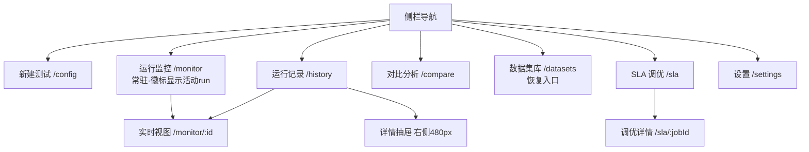
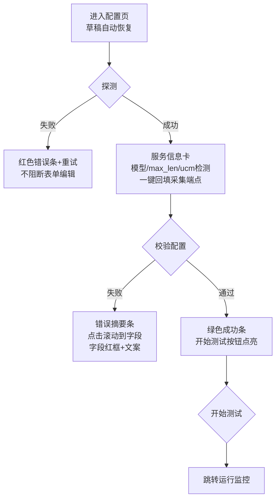
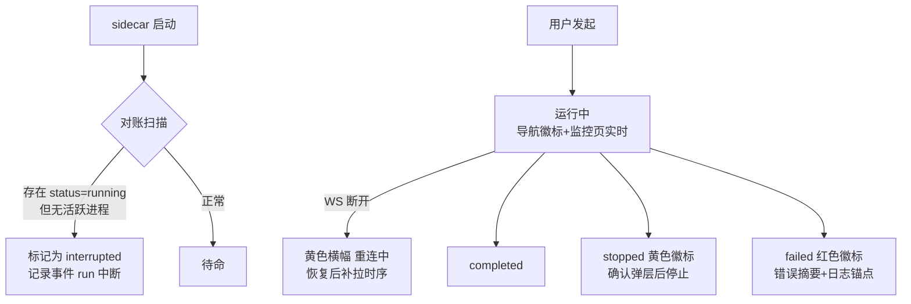

# UX 重设计需求文档 — AISBench 前缀复用测试器 v0.2

> 依据：`docs/UX-AUDIT.md`（24 项新问题）+ 用户反馈 8 组问题
> 方法：prd-to-design-doc 模板（信息架构 → 交互流程 → 布局规范 → 视觉规范 → 异常状态 → 埋点 → 交付清单）
> 约定：栅格 8pt；页面主体最大宽 1280px 居中；所有「粘性」指 `position: sticky`。

---

## 1. 背景与设计目标

| 维度 | 目标 |
|---|---|
| 体验 | 新用户 5 分钟内完成「连接→发起→看结果」；旧用户 3 步内完成「对比两次 run」 |
| 可信 | 任何影响数据正确性的事件（清理失败/断连/中断）必须在主视觉层告知 |
| 一致 | 6 个页面共用一套栅格、卡片、图表、空状态规范；术语表统一 |

核心挑战：单屏信息密度高（压测参数 20+ 项）与「结果可读性」的平衡；打包产物与主分支长期脱节的发布问题（流程问题，见 §9 风险）。

## 2. 用户角色与场景

- **测试工程师（主）**：连远端 vLLM 起压测、看命中率/延迟、导报告 → 主流程：新建测试→监控→记录/对比
- **容量规划（辅）**：SLA 调优找最大并发 → SLA 页
- **平台维护（辅）**：配置 tokenizer/诊断环境 → 设置页

## 3. 信息架构（重设计后）



- 监控从「隐藏路由」升级为一级入口：无活动 run 时显示最近一次 run 的回放+空状态引导。
- 数据集库承接「复用已入库数据集」「数据集预览」（从配置页抽离，配置页保留入口按钮）。

## 4. 核心交互流程

### 4.1 新建测试主流程（含校验与失败分支）



### 4.2 运行生命周期（含僵尸对账）



## 5. 关键交互细节

| 模块 | 规则 |
|---|---|
| 表单反馈 | 所有提交类按钮 3 态：default / loading（禁止重复点击）/ 结果反馈（成功绿条 or 错误红条，10s 自动消失，错误不消失） |
| 校验时机 | 必填项失焦即校验；「校验配置」做全量校验；「开始测试」前置全量校验拦截 |
| 预设 | 预设=表单快照 JSON；切换预设弹 diff 确认（列出将改变的 N 项） |
| 删除 | 单删确认弹层（红色主按钮）；批量删除显示数量；所有删除在 toast 里给 5s「撤销」（软删除） |
| 主题 | 跟随系统/浅/深；切换不重启；图表色板随主题切换（见 §7） |

## 6. 页面布局规范（ASCII 线框，1440 基准）

### 6.1 新建测试（解决：摘要栏空置、开始按钮位置、小屏溢出、字段联动）

```
┌────────────────────────────────────────────────────────────────────┐
│ 运行名称 [____________________]  预设[快速冒烟 ▾] [保存为预设]      │  ← 新增首行
├──────────────────────────────────┬─────────────────────────────────┤
│ ① 服务连接（2列栅格）             │  摘要与体检（粘性侧栏 320px）    │
│  地址*______ 端口*___ [⊙探测]    │  ┌─────────────────────────┐    │
│  [服务信息卡：模型/长度/UCM ✓]    │  │ 目标 203.0.113.10:8101   │    │
│  模型目录____ | 预置[Qwen3 ▾]     │  │ 输入/输出 4096/32       │    │
│    ↑二选一：选预置→目录框禁用      │  │ 理论命中率 ≈89.99%      │    │
│  API Key____  Summarizer[▾]      │  │ 采集端点 1 个 ✓可达      │    │
│ ② 前缀与数据集（4列栅格）         │  │ 轮次 2 · 并发 4/1        │    │
│  [词表来源 + 说明icon tooltip]    │  └─────────────────────────┘    │
│  [数据集：自动生成 | 复用▾ 预览]  │  ┌─────────────────────────┐    │
│ ③ 并发与调度（4列栅格）           │  │ [校验配置]  [▶ 开始测试] │ ← 吸附侧栏底部
│ ④ 采集端点（chip化+逐行可达点）   │  │ 与表单底部对齐，不悬空    │    │
│ ⑤ 多轮计划（表格+JSON 双模式）    │  └─────────────────────────┘    │
└──────────────────────────────────┴─────────────────────────────────┘
窄屏(<1100px)：侧栏改为表单上方的横向摘要条；操作按钮 sticky 吸底；
所有栅格 minmax(0,1fr) 禁止横向溢出（当前 1024px 下表单被裁切，见 ux-config-narrow.png）。
```

字段联动规则（响应「采集端点要填两遍/URL 怎么填」）：
- 采集端点为空时自动跟随 `服务地址:端口`；一旦手动编辑则锁定并显示「已手动覆盖 ✕」可一键恢复联动。
- 填写「完整 URL」时，地址/端口字段折叠为只读摘要（从 URL 解析回显），消除三字段并存歧义。

### 6.2 运行监控（解决：图宽不一、点稀疏、饼图 100%、日志区小）

```
┌ run 头部：run_id · 名称 · 状态徽标 · 耗时 · [参数chips] [导出报告] ┐
├ KPI 行：6 等宽卡（HBM/Ext/综合/并发/KV/TTFT/吞吐）
│   · 命中率卡副行：理论 xx% · 偏差 -6.7pt；TTFT 卡叠 SLA 参考线
├ 图表区：12 列栅格，每行两图各占 6 列（等宽等高 280px，canvas 撑满）
│   [队列深度+KV 合并卡 6列] [吞吐 6列]
│   [延迟趋势 6列]          [命中率趋势 6列]
│   阶段边界：垂直虚线 + 顶部标签 R1-warmup/R1-full；轮次分色
│   悬停十字线 tooltip；框选缩放；右上 [导出CSV]
├ Prefix Cache Breakdown（4列）：环形图中心=综合命中率（修正 100% 错位）
│   非UCM时不显示 UCM 带宽图与⚠横幅（收进「指标说明」）
├ 日志区（12列全宽，高度可拖拽 240-600px，默认 360px）
│   工具条：全部/WARN/ERROR/关键字搜索 ▾ | 折叠进度行 ✓ | stdout|stderr | 导出
└────────────────────────────────────────────────────────────────────┘
```

图表点稀疏对策：采集间隔在「有活动请求」时自动提升到 1s（空闲回落到设置值）；单阶段不足 5 点时改画阶梯线+事件点，避免「两个尖峰的折线」。

### 6.3 运行记录（解决：操作噪音、删除风险、抽屉遮挡）

```
工具栏：[手动|SLA|全部] [状态▾(失败/完成/停止/运行)] [搜索]  共N条 | [对比所选(2)] [删除(2)]
表格列：☑ | 名称/run_id | 状态徽标 | 时间 | HBM | Ext | TTFT avg | 吞吐 | 轮次 | (hover浮出: 监控 详情 xlsx 删除)
右侧抽屉 480px + 遮罩：详情/轮×阶段表/导出/标记练习轮；ESC与点遮罩关闭；不遮挡顶部工具栏
```

### 6.4 对比分析（解决：按钮沉底、结果无可视化）

```
顶部粘性条：已选 chips [runA ×] [runB ×] + [排除warmup☑] [排除练习轮☑] [▶ 开始对比](常驻可点)
主体 tabs：指标总览(对柱图+Δ标注) | 逐轮对比 | DP 矩阵 | 配置差异 | [导出xlsx/HTML]
被排除的练习轮：列表中半透明+徽标
```

### 6.5 SLA 调优（解决：左右排布失衡、截断、无可视化）

```
上：配置卡（全宽 12 列：目标一行 6 字段 + SLA 条件行 + 并发范围 + [▶开始调优]）
下：结果区（全宽）
  [进度条：爬升 c=32 → 二分[64,128] | 停止调优]
  [并发-延迟双轴曲线：x并发 左TTFT/TPOT 右吞吐 SLA横线 拐点标注]
  探针表（与曲线联动 hover）     历史调优表（说明列 ellipsis+悬停全文+固定列宽）
```

### 6.6 设置（解决：诊断占比失衡）

```
左侧 tab：通用(主题/采集间隔默认) | 压测执行(命令覆盖/work_path) | Tokenizer资产 | 关于
环境诊断：折叠为 1 行摘要「✓ 自包含 · ais_bench 0.26 · 磁盘 35GB [展开]」，展开才显示逐项；
「重启 Sidecar」移入诊断展开区 + 确认弹层
```

## 7. 视觉规范

- **间距**：4/8/12/16/24/32；卡片内边距 16，卡片间距 16，分区间距 24。
- **字号**：页面标题 20/600；卡片标题 14/600；正文 13/400；辅助 12/400；KPI 数值 28/700（tabular-nums）。行高 1.5，最小 12px。
- **色彩（暗色基准，浅色同构）**：
  - 背景 #0f1115 / 卡片 #171a21 / 描边 #262b36；正文 #e6e9f0 / 辅助 #9aa3b2（对比度 ≥4.5:1）
  - 主色 #3b82f6；成功 #10b981；警告 #f59e0b；危险 #ef4444
  - 图表 8 色（色弱安全）：#3b82f6 #10b981 #f59e0b #ef4444 #8b5cf6 #14b8a6 #f472b6 #64748b；running=蓝 waiting=黄 swapped=红（现状保留）；图例加线型区分（实/虚/点）
- **状态徽标**：运行=蓝点脉冲；完成=绿；停止=黄；失败=红；中断=灰黄。形状+颜色双编码（色弱可用）。
- **空/载/错三态**：每块内容区必须有 空状态（图示+主按钮）、加载骨架、错误态（重试按钮）；禁止空白哑区。

## 8. 异常状态处理

| 场景 | 行为 |
|---|---|
| sidecar 未连接 | 全页面顶部黄条「服务未连接，重连中…」；页面只读 |
| run 被中断（重启/崩溃） | 启动对账标记 interrupted；监控页显示中断时间点与已采集数据 |
| /reset_prefix_cache 404 | run 头部黄色徽标「轮间清理不可用，已用 seed 偏移兜底」+ 详情警告行（不再只藏在表格列） |
| 指标端点不可达 | 图表卡内灰态「端点 x 不可达」；KPI 卡不显示假 0 |
| 校验失败 | 见 §4.1 |

## 9. 埋点需求（本地事件，写 sidecar 日志/JSONL）

| 事件 | 触发 | 参数 |
|---|---|---|
| config_validate_result | 校验配置 | ok, error_fields[] |
| run_submit / run_finish | 提交/结束 | run_id, preset, rounds, status, duration |
| chart_export | 导出CSV | run_id, chart |
| compare_run | 开始对比 | run_ids[], metrics_viewed |
| sla_job_finish | 调优结束 | job_id, max_ok, probes |
| error_surface | 错误条展示 | code, page |

## 10. 交付清单

1. 高保真稿 ×6（config/monitor/history/compare/sla/settings，1440 与 1024 两档）
2. 组件：状态徽标、KPI 卡、图表容器（tooltip/缩放/导出）、抽屉、确认弹层、toast、空/载/错三态
3. 术语表 + 图表色板 token（CSS variables）
4. 交互流程图（mermaid 源码已在本档 §4）

## 11. 风险与依赖

| 风险 | 应对 |
|---|---|
| 打包产物长期落后 main（本审计两次走查为两个不同版本） | 建立 release 流程：main 合入→单测+UI 冒烟→自动打包→版本号写入「关于」 |
| 内置 exe 子模式阻断 bug（HANDOFF §5）未修，「免安装」承诺不成立 | 重设计不依赖它；但发布前必须修复并用真实服务器验收（断言 perf 明细存在） |
| 图表 1s 高频采集对大 run 的存储/渲染压力 | 采集窗口自适应（活动期 1s、空闲 5-30s）；JSONL 按天分片；前端抽稀（>2000 点降采样） |
| 自绘 SVG 图表改造 tooltip/缩放工作量 | 预估每图 0.5-1 天，优先 KPI 关联的 4 张主图 |
